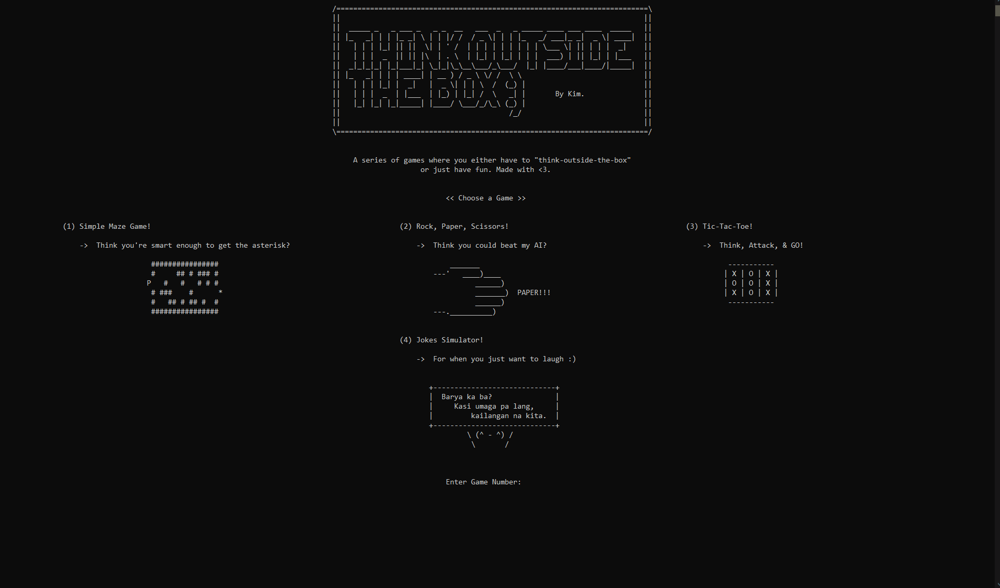

# think-outside-the-box by Kim.
Our final project for Computer Programming 1. Used ASCII art for the design and a whole lot of rand(). 👾

## Games Included
- **Maze Game** – Find your way out and get the asterisk.
- **Rock-Paper-Scissors** –  Play against the computer for 1, 3, or 7 rounds of a classic 'rock-paper-scissors' shoot!
- **Tic-Tac-Toe** – Play against the computer using numbers.
- **Jokes Simulator** – Corny jokes, haha.
- **Secret Number Guessing** – Try to guess the number.

Demo:
- Maze Game 🗺️

- Rock-Paper-Scissors ✊📃✂️

- Tic-Tac-Toe ⭕❌

- Jokes Simulator 🎙️

- Secret Number Guessing ❶

## How to run?

1) You need a C++ compiler installed. Like:

- Windows: MinGW or Visual Studio
- Linux: g++ (install with sudo apt install g++)
- Mac: g++ (install via Xcode Command Line Tools: xcode-select --install)

2) Run the cpp file with the sln file or cpp file directly.
